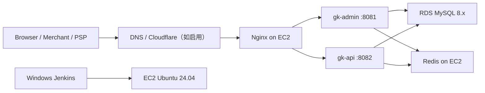

# gk-union 生产环境部署与运维文档

本文档用于记录 `gk-union` 在 AWS EC2 Ubuntu 24.04 上的生产部署方式、配置文件、发布流程和常见故障处理。

> 敏感信息约定：数据库密码、Redis 密码、SSH 私钥、Git 凭证、真实 Token 不写入仓库，统一使用 `<PLACEHOLDER>` 占位。

## 1. 项目与部署架构

### 1.1 项目信息

- 项目名称：`gk-union`
- 技术栈：Spring Boot `3.5.14`、Java `21`
- 打包方式：Maven 多模块，启动应用为可执行 Jar
- 根模块：`pom.xml`
- 主要启动模块：
  - `gk-admin`：后台管理服务
  - `gk-api`：商户 OpenAPI 与 PSP 回调入口服务

### 1.2 当前模块划分

根 `pom.xml` 已包含以下模块：

- `gk-common`
- `gk-infra`
- `gk-meta`
- `gk-admin`
- `gk-api`
- `gk-scheduler`
- `gk-auth`
- `gk-devtools`
- `gk-iam`
- `gk-notify`
- `gk-merchant`
- `gk-psp`
- `gk-ledger`
- `gk-payment`
- `gk-openapi`

`gk-admin` 依赖后台管理相关模块，包括 `gk-auth`、`gk-iam`、`gk-ledger`、`gk-merchant`、`gk-payment`、`gk-notify`、`gk-psp`、`gk-scheduler` 等。

`gk-api` 依赖 `gk-openapi` 和 `gk-payment`，用于对外商户接口与 PSP 回调。

### 1.3 服务器架构



当前规划：

- EC2：运行 `gk-admin`、`gk-api`、Nginx、Redis
- RDS MySQL：独立数据库服务
- Nginx：
  - `admin.lllin.fun` -> `127.0.0.1:8081`
  - `api.lllin.fun` -> `127.0.0.1:8082`
- systemd：
  - `gk-admin.service`
  - `gk-api.service`
- Jenkins：从 Windows 机器构建 Jar，并通过 SSH/SCP 发布到 EC2

## 2. AWS 服务选择说明

### 2.1 EC2

建议使用 EC2 部署当前阶段的应用，因为：

- `gk-admin` 和 `gk-api` 都是普通 Spring Boot Jar，适合 systemd 管理
- Redis 暂时部署在本机，便于低成本启动
- Nginx、证书、日志目录、Jenkins 远程部署都容易控制

当前已使用 Ubuntu 24.04 LTS。Ubuntu LTS 的优点：

- 官方长期维护
- 软件包稳定
- 社区资料多
- Java、Nginx、Redis、Certbot 安装简单

需要确认：

- EC2 实例规格是否长期使用 `t3.medium`
- 是否需要后续改成 Savings Plans 或预留实例降低成本
- 是否需要绑定弹性公网 IP，避免实例重启后公网 IP 变化

### 2.2 RDS MySQL

建议使用 RDS MySQL 8.x，不建议生产数据库直接放 EC2，原因：

- 自动备份更方便
- 存储扩容更简单
- 安全组隔离更清晰
- 后续可以增加只读副本或多可用区

当前已确认：

- 应用使用 MySQL JDBC
- 数据库名建议：`gk_union`
- RDS 端口：`3306`
- EC2 到 RDS 需要通过安全组放行 3306

需要确认：

- RDS 是否开启自动备份
- RDS 是否开启存储自动扩展
- RDS 是否需要公网访问。如果只允许 EC2 访问，更安全；如果本地 Navicat 需要直连，需要额外放行本机公网 IP。

### 2.3 Redis

当前 Redis 暂时部署在 EC2 本机：

- `REDIS_HOST=127.0.0.1`
- `REDIS_PORT=6379`

生产建议：

- Redis 不要开放公网
- 如后续请求量上升或要求高可用，可迁移到 ElastiCache

## 3. EC2 初始化

### 3.1 基础更新

```bash
sudo apt update
sudo apt upgrade -y
sudo reboot
```

重启后重新登录：

```bash
ssh -i <PRIVATE_KEY> ubuntu@<EC2_PUBLIC_IP>
```

### 3.2 创建运行用户和目录

应用运行用户建议使用不可登录的系统用户 `gk`：

```bash
sudo useradd --system --create-home --home-dir /opt/gk --shell /usr/sbin/nologin gk
```

创建目录：

```bash
sudo mkdir -p /opt/gk-admin/app /opt/gk-admin/config
sudo mkdir -p /opt/gk-api/app /opt/gk-api/config
sudo mkdir -p /data/logs/gk-admin /data/logs/gk-api
```

设置权限：

```bash
sudo chown -R gk:gk /opt/gk-admin /opt/gk-api
sudo chown -R gk:gk /data/logs/gk-admin /data/logs/gk-api
```

如果使用 Jenkins 的 `deploy` 用户上传 Jar：

```bash
sudo usermod -aG gk deploy
sudo chmod 775 /opt/gk-admin/app /opt/gk-api/app
```

用户组变更后，`deploy` 需要重新登录 SSH 才会生效。

## 4. JDK 21 安装

Ubuntu 24.04 可安装 OpenJDK 21：

```bash
sudo apt update
sudo apt install -y openjdk-21-jdk
java -version
which java
```

期望：

```text
openjdk version "21..."
/usr/bin/java
```

systemd 模板中使用：

```ini
ExecStart=/bin/sh -c 'exec /usr/bin/java $JAVA_OPTS -jar /opt/gk-admin/app/gk-admin.jar'
```

## 5. Redis 安装和配置

安装：

```bash
sudo apt install -y redis-server
sudo systemctl enable --now redis-server
sudo systemctl status redis-server --no-pager
```

确认监听：

```bash
redis-cli ping
sudo ss -lntp | grep 6379
```

建议 Redis 只监听本机。检查 `/etc/redis/redis.conf`：

```text
bind 127.0.0.1 ::1
protected-mode yes
```

如设置 Redis 密码，应用 env 中也要同步：

```bash
REDIS_PASSWORD=<REDIS_PASSWORD>
```

当前项目 env 示例默认本机 Redis：

```bash
REDIS_HOST=127.0.0.1
REDIS_PORT=6379
REDIS_DATABASE=0
REDIS_PASSWORD=
```

## 6. RDS MySQL 连接配置

### 6.1 安全组

推荐规则：

- RDS 入站：允许 EC2 安全组访问 TCP `3306`
- EC2 出站：允许访问 RDS `3306`
- 如本地 Navicat 需要连接 RDS：RDS 入站额外允许你的本机公网 IP `/32` 访问 `3306`

不建议：

- RDS 入站开放 `0.0.0.0/0`

### 6.2 EC2 连通性测试

可安装 `netcat` 测试端口：

```bash
sudo apt install -y netcat-openbsd
nc -zv <RDS_ENDPOINT> 3306
```

成功示例：

```text
Connection to <RDS_ENDPOINT> 3306 port [tcp/mysql] succeeded!
```

说明：Java 应用可以直接连接数据库，`mysql-client` 不是必需组件；安装客户端只是方便人工排查。

### 6.3 JDBC URL

env 示例：

```bash
DB_URL=jdbc:mysql://<RDS_ENDPOINT>:3306/gk_union?useUnicode=true&characterEncoding=utf8&useSSL=false&allowPublicKeyRetrieval=true&serverTimezone=UTC
DB_USERNAME=<DB_USERNAME>
DB_PASSWORD=<DB_PASSWORD>
```

需要确认：

- 生产是否要求开启 SSL。如果要求开启，需要调整 JDBC 参数，并配置 RDS CA 证书。

## 7. 应用目录规划

当前目录规范：

```text
/opt/gk-admin/app/gk-admin.jar
/opt/gk-admin/config/gk-admin.env
/opt/gk-api/app/gk-api.jar
/opt/gk-api/config/gk-api.env
/data/logs/gk-admin
/data/logs/gk-api
```

Jar 放在 `app`，环境变量放在 `config`，日志放在 `/data/logs`。

建议：

- env 文件不要放进 Git
- env 文件权限设置为 `640`
- env 文件属主建议 `root:gk`

```bash
sudo chown root:gk /opt/gk-admin/config/gk-admin.env /opt/gk-api/config/gk-api.env
sudo chmod 640 /opt/gk-admin/config/gk-admin.env /opt/gk-api/config/gk-api.env
```

## 8. systemd 服务配置

模板文件：

- `deploy/systemd/gk-admin.service`
- `deploy/systemd/gk-api.service`

安装：

```bash
sudo cp deploy/systemd/gk-admin.service /etc/systemd/system/gk-admin.service
sudo cp deploy/systemd/gk-api.service /etc/systemd/system/gk-api.service
sudo systemctl daemon-reload
```

启动：

```bash
sudo systemctl enable --now gk-admin
sudo systemctl enable --now gk-api
```

重启策略：

```ini
Restart=on-failure
RestartSec=10
StartLimitIntervalSec=300
StartLimitBurst=3
```

含义：

- 异常退出自动重启
- 10 秒后重启
- 5 分钟内失败 3 次后停止继续重启

如果服务进入 failed 限制，修复配置后执行：

```bash
sudo systemctl reset-failed gk-admin
sudo systemctl start gk-admin
```

`gk-api` 同理。

## 9. 环境变量配置

模板文件：

- `deploy/env/gk-admin.env.example`
- `deploy/env/gk-api.env.example`

复制：

```bash
sudo cp deploy/env/gk-admin.env.example /opt/gk-admin/config/gk-admin.env
sudo cp deploy/env/gk-api.env.example /opt/gk-api/config/gk-api.env
```

### 9.1 gk-admin 关键变量

```bash
SPRING_PROFILES_ACTIVE=prod
APP_NAME=gk-admin
SERVER_PORT=8081
TZ=UTC
APP_TIME_ZONE=UTC
JAVA_OPTS="-Xms512m -Xmx512m -XX:+UseG1GC -Dfile.encoding=UTF-8 -Duser.timezone=UTC"
DB_URL=<JDBC_URL>
DB_USERNAME=<DB_USERNAME>
DB_PASSWORD=<DB_PASSWORD>
REDIS_HOST=127.0.0.1
LOG_HOME=/data/logs/gk-admin
LOG_FILE=/data/logs/gk-admin/gk-admin.log
PSP_CALLBACK_BASE_URL=https://api.lllin.fun
```

`gk-admin` 当前生产连接池默认：

```bash
DB_POOL_MAX_SIZE=10
DB_POOL_MIN_IDLE=2
```

### 9.2 gk-api 关键变量

```bash
SPRING_PROFILES_ACTIVE=prod
APP_NAME=gk-api
SERVER_PORT=8082
TZ=UTC
APP_TIME_ZONE=UTC
JAVA_OPTS="-Xms768m -Xmx768m -XX:+UseG1GC -Dfile.encoding=UTF-8 -Duser.timezone=UTC"
DB_URL=<JDBC_URL>
DB_USERNAME=<DB_USERNAME>
DB_PASSWORD=<DB_PASSWORD>
REDIS_HOST=127.0.0.1
LOG_HOME=/data/logs/gk-api
LOG_FILE=/data/logs/gk-api/gk-api.log
PSP_CALLBACK_BASE_URL=https://api.lllin.fun
```

`gk-api` 当前生产连接池默认：

```bash
DB_POOL_MAX_SIZE=20
DB_POOL_MIN_IDLE=5
```

需要确认：

- `PSP_CALLBACK_BASE_URL` 是否统一使用 `https://api.lllin.fun`
- Redis 是否需要密码
- 生产 JVM 内存是否按当前 EC2 内存继续使用

## 10. Nginx 配置

模板文件：

- `deploy/nginx/gk-union.conf.example`

安装：

```bash
sudo apt install -y nginx
sudo cp deploy/nginx/gk-union.conf.example /etc/nginx/sites-available/gk-union.conf
sudo ln -s /etc/nginx/sites-available/gk-union.conf /etc/nginx/sites-enabled/gk-union.conf
sudo rm -f /etc/nginx/sites-enabled/default
sudo nginx -t
sudo systemctl reload nginx
```

说明：

- `ln -s`：把 `sites-available` 里的配置启用到 `sites-enabled`
- `rm -f default`：移除默认站点，避免默认配置抢占域名或端口

当前反代规划：

```text
admin.lllin.fun -> http://127.0.0.1:8081
api.lllin.fun   -> http://127.0.0.1:8082
```

确认本机服务：

```bash
curl -I http://127.0.0.1:8081
curl -I http://127.0.0.1:8082
```

确认 Nginx：

```bash
sudo nginx -t
sudo systemctl status nginx --no-pager
sudo journalctl -u nginx -n 100 --no-pager
```

## 11. HTTPS 证书申请和续期

安装 Certbot：

```bash
sudo apt install -y certbot python3-certbot-nginx
```

申请证书：

```bash
sudo certbot --nginx -d admin.lllin.fun -d api.lllin.fun
```

首次执行会要求输入邮箱，用于证书续期和安全通知。必须输入真实可接收邮件地址。

测试续期：

```bash
sudo certbot renew --dry-run
```

查看证书：

```bash
sudo certbot certificates
```

需要确认：

- 域名 DNS 是否已解析到 EC2 公网 IP
- 如果启用 Cloudflare 代理，SSL/TLS 模式建议使用 Full 或 Full strict
- 证书申请前，安全组必须允许公网访问 `80` 和 `443`

## 12. Jenkins 自动部署

模板文件：

- `deploy/jenkins/Jenkinsfile.admin.example`
- `deploy/jenkins/Jenkinsfile.api.example`

### 12.1 Jenkins 前置要求

Windows Jenkins 机器需要：

- Git
- Maven 工具，Jenkins 名称示例：`maven-3.9`
- Git SSH/SCP：
  - `C:\Program Files\Git\usr\bin\ssh.exe`
  - `C:\Program Files\Git\usr\bin\scp.exe`

### 12.2 Jenkins 凭证

需要两个凭证：

1. Git 仓库凭证
   - 类型：按仓库实际情况选择，如 Username with password / GitHub token
   - Jenkinsfile 中替换：`<GIT_CREDENTIAL_ID>`

2. EC2 SSH 私钥凭证
   - 类型：`SSH Username with private key`
   - Username：`deploy`
   - Private Key：部署私钥内容
   - Jenkinsfile 中替换：`<SSH_CREDENTIAL_ID>`

不要把私钥写入 Jenkinsfile。

### 12.3 构建命令

`gk-admin`：

```bat
mvn clean package -pl gk-admin -am -DskipTests
```

`gk-api`：

```bat
mvn clean package -pl gk-api -am -DskipTests
```

### 12.4 远程部署权限

`deploy` 用户需要能上传 Jar：

```bash
sudo usermod -aG gk deploy
sudo chmod 775 /opt/gk-admin/app /opt/gk-api/app
```

`deploy` 用户需要免密执行指定 systemctl 命令。建议用独立 sudoers 文件：

```bash
sudo visudo -f /etc/sudoers.d/gk-deploy
```

示例：

```text
deploy ALL=(root) NOPASSWD: /usr/bin/systemctl restart gk-admin
deploy ALL=(root) NOPASSWD: /usr/bin/systemctl status gk-admin --no-pager
deploy ALL=(root) NOPASSWD: /usr/bin/systemctl restart gk-api
deploy ALL=(root) NOPASSWD: /usr/bin/systemctl status gk-api --no-pager
```

保存后：

```bash
sudo chmod 440 /etc/sudoers.d/gk-deploy
```

测试：

```bash
sudo -n /usr/bin/systemctl status gk-admin --no-pager
sudo -n /usr/bin/systemctl status gk-api --no-pager
```

## 13. 日志目录和查看方式

### 13.1 systemd 日志

```bash
sudo journalctl -u gk-admin -f
sudo journalctl -u gk-api -f

sudo journalctl -u gk-admin -n 200 --no-pager
sudo journalctl -u gk-api -n 200 --no-pager
```

### 13.2 应用文件日志

当前 logback 配置使用：

```text
${LOG_HOME}/${APP_NAME}.log
${LOG_HOME}/yyyy-MM-dd/${APP_NAME}.%i.log
```

示例：

```bash
tail -f /data/logs/gk-admin/gk-admin.log
tail -f /data/logs/gk-api/gk-api.log

ls -lh /data/logs/gk-admin
ls -lh /data/logs/gk-api
```

按日期滚动目录示例：

```text
/data/logs/gk-admin/2026-07-04/gk-admin.0.log
/data/logs/gk-api/2026-07-04/gk-api.0.log
```

### 13.3 Nginx 日志

```bash
sudo tail -f /var/log/nginx/access.log
sudo tail -f /var/log/nginx/error.log
```

## 14. 常用运维命令

### 14.1 服务状态

```bash
sudo systemctl status gk-admin --no-pager
sudo systemctl status gk-api --no-pager
sudo systemctl status nginx --no-pager
sudo systemctl status redis-server --no-pager
```

### 14.2 重启服务

```bash
sudo systemctl restart gk-admin
sudo systemctl restart gk-api
sudo systemctl restart nginx
sudo systemctl restart redis-server
```

### 14.3 查看端口

```bash
sudo ss -lntp | grep 8081
sudo ss -lntp | grep 8082
sudo ss -lntp | grep 80
sudo ss -lntp | grep 443
sudo ss -lntp | grep 6379
```

### 14.4 本机接口测试

```bash
curl -I http://127.0.0.1:8081
curl -I http://127.0.0.1:8082
curl -I http://admin.lllin.fun
curl -I http://api.lllin.fun
```

需要确认：

- 项目是否有统一健康检查接口。如果后续引入 Actuator，可使用 `/actuator/health`。

### 14.5 磁盘和内存

```bash
df -h
free -h
du -sh /data/logs/gk-admin /data/logs/gk-api
```

## 15. 故障排查

### 15.1 Cloudflare / 浏览器 502 Bad Gateway

常见原因：

- `gk-admin` 或 `gk-api` 没启动
- Nginx proxy_pass 端口错
- 应用启动后立即失败
- Nginx 配置未 reload
- Cloudflare 回源访问 80/443 被安全组拦截

排查：

```bash
sudo systemctl status gk-admin --no-pager
sudo systemctl status gk-api --no-pager
sudo ss -lntp | grep 8081
sudo ss -lntp | grep 8082
curl -I http://127.0.0.1:8081
curl -I http://127.0.0.1:8082
sudo nginx -t
sudo tail -n 100 /var/log/nginx/error.log
```

### 15.2 服务启动失败

查看：

```bash
sudo systemctl status gk-admin --no-pager
sudo journalctl -u gk-admin -n 200 --no-pager
```

重点看：

- `DB_URL` 是否为空或错误
- RDS 安全组是否放行
- Redis 是否可连接
- 表结构是否完整
- env 文件是否权限错误或格式错误

如果 systemd 限制了重启：

```bash
sudo systemctl reset-failed gk-admin
sudo systemctl start gk-admin
```

### 15.3 数据库连不上

端口测试：

```bash
nc -zv <RDS_ENDPOINT> 3306
```

如果 `No route to host`：

- 检查 EC2 与 RDS 是否在同一 VPC 或网络可达
- 检查 RDS 安全组入站是否允许 EC2 安全组
- 检查 EC2 出站规则
- 检查 RDS 是否处于 available 状态

### 15.4 Quartz 表大小写问题

现象：

```text
Table 'gk_union.QRTZ_FIRED_TRIGGERS' doesn't exist
```

原因：

- Linux/RDS MySQL 表名通常大小写敏感
- 数据库表为小写 `qrtz_fired_triggers`
- 应用或 Quartz 配置使用了大写 `QRTZ_`

当前项目已将 Quartz 表前缀调整为小写：

```java
tablePrefix = "qrtz_"
```

对应文件：

- `gk-scheduler/src/main/java/com/gk/quartz/config/ScheduleConfig.java`
- `gk-scheduler/src/main/java/com/gk/quartz/init/QuartzStateRepairer.java`

### 15.5 Jenkins 上传 Permission denied

现象：

```text
scp: dest open "/opt/gk-admin/app/gk-admin.jar.tmp": Permission denied
```

处理：

```bash
sudo usermod -aG gk deploy
sudo chown -R gk:gk /opt/gk-admin /opt/gk-api
sudo chmod 775 /opt/gk-admin/app /opt/gk-api/app
```

然后重新登录 `deploy`。

### 15.6 Jenkins 找不到 ssh/scp

Windows Jenkins 如果没有 OpenSSH，可使用 Git 自带：

```text
C:\Program Files\Git\usr\bin\ssh.exe
C:\Program Files\Git\usr\bin\scp.exe
```

Jenkinsfile 中已经使用 `SSH_EXE`、`SCP_EXE` 指定路径。

## 16. 安全建议

### 16.1 SSH

- 不允许 root 直接 SSH 登录
- 使用密钥登录
- SSH 22 端口安全组只允许固定办公 IP
- Jenkins 部署用户只授予必要 systemctl 命令

### 16.2 RDS

- 不要开放 `0.0.0.0/0:3306`
- 优先允许 EC2 安全组访问
- 如果 Navicat 需要连接，只放行本机公网 IP `/32`
- 开启自动备份
- 定期检查慢 SQL 和连接数

### 16.3 Redis

- Redis 不开放公网
- 只监听 `127.0.0.1`
- 如业务需要，可设置密码
- 后续可迁移到 ElastiCache

### 16.4 env 文件

- env 文件不提交 Git
- 权限建议 `640`
- 属主建议 `root:gk`
- 密码、token、私钥不写入文档

### 16.5 Nginx 和 HTTPS

- 生产环境开启 HTTPS
- 80 端口保留用于证书续期和跳转
- 定期检查证书续期：

```bash
sudo certbot renew --dry-run
```

### 16.6 应用配置

- `knife4j` 生产建议关闭或加 Basic Auth
- `gk-api` 当前只允许 `/api/v1/**` 与 `/psp/callback/**`
- 对外接口签名、回调验签、IP 白名单应保持开启

## 17. 发布检查清单

发布前：

- [ ] Jenkins 构建成功
- [ ] Jar 上传成功
- [ ] env 文件已配置生产 DB/Redis
- [ ] RDS 可从 EC2 连通
- [ ] Redis 正常
- [ ] Nginx 配置测试通过
- [ ] 证书有效

发布后：

- [ ] `systemctl status gk-admin` 正常
- [ ] `systemctl status gk-api` 正常
- [ ] `ss -lntp` 可看到 8081/8082
- [ ] `journalctl` 无启动异常
- [ ] 文件日志正常写入 `/data/logs`
- [ ] 域名访问无 502

## 18. 需要确认项

以下信息不建议在仓库中硬编码，需要在部署时确认：

- EC2 是否绑定弹性公网 IP
- RDS 是否公网可访问
- RDS 是否启用自动备份与存储自动扩展
- Redis 是否设置密码
- `PSP_CALLBACK_BASE_URL` 最终是否为 `https://api.lllin.fun`
- Cloudflare SSL/TLS 模式是否为 Full 或 Full strict
- 是否需要 Actuator 健康检查接口
- 是否需要将 Redis 迁移到 ElastiCache
- 是否需要把日志接入 CloudWatch
